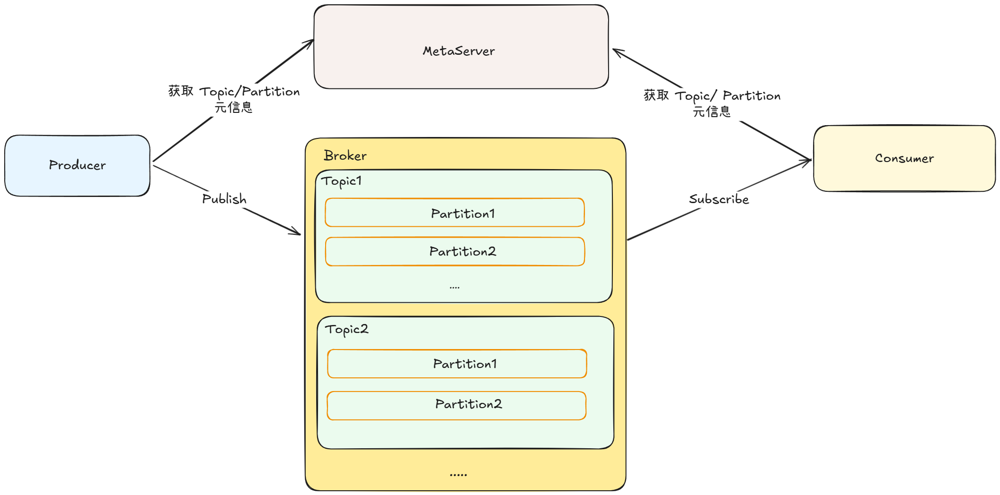
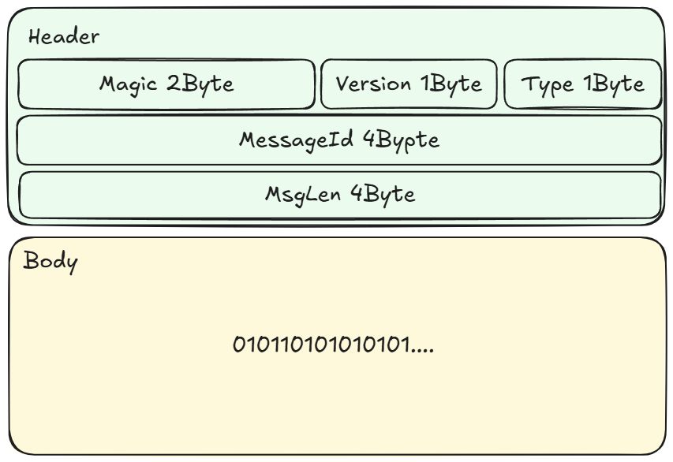

# 如何手写一个消息队列
## 1. 整体框架

消息队列的整体架构如图所示，包含生产者、消费者、存储元数据的 MetaServer、实际存储 Topic/Partition 的 Broker

## 2. 核心模块划分
### 2.1 网络模块
网络模块包含两部分：1. 消息协议 2. 网络连接
#### 2.1.1 消息协议
消息协议的设计应该要有以下几个特点：1. 消息大小尽可能小，消息队列的吞吐和消息的大小成反比  2. 可扩展，消息协议需要能做到向前兼容，方便功能扩展。

一个完整的消息会包含 header 和 body 两部分：
* header
1. Magic：魔数，用来快速标识是否为需要处理的“合法”数据
2. Version：版本，方便后续兼容升级
3. Type: 消息类型，标识消息为生产者请求、消费者请求、ACK 等消息类型
4. MessageId： 消息唯一标识，实现全双工通信
5. MsgLen： 消息长度，为 Body 的消息长度
* body: 承载按照特定序列化之后的产物，即实际的数据长度
### 2.2 生产者
### 2.3 消费者
### 2.4 数据存储